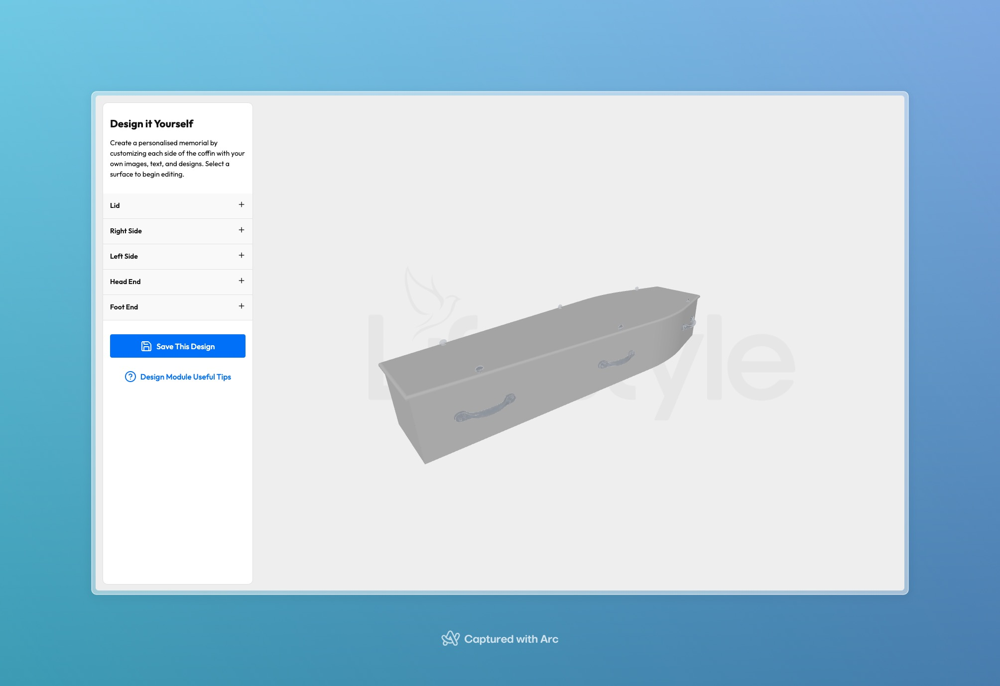
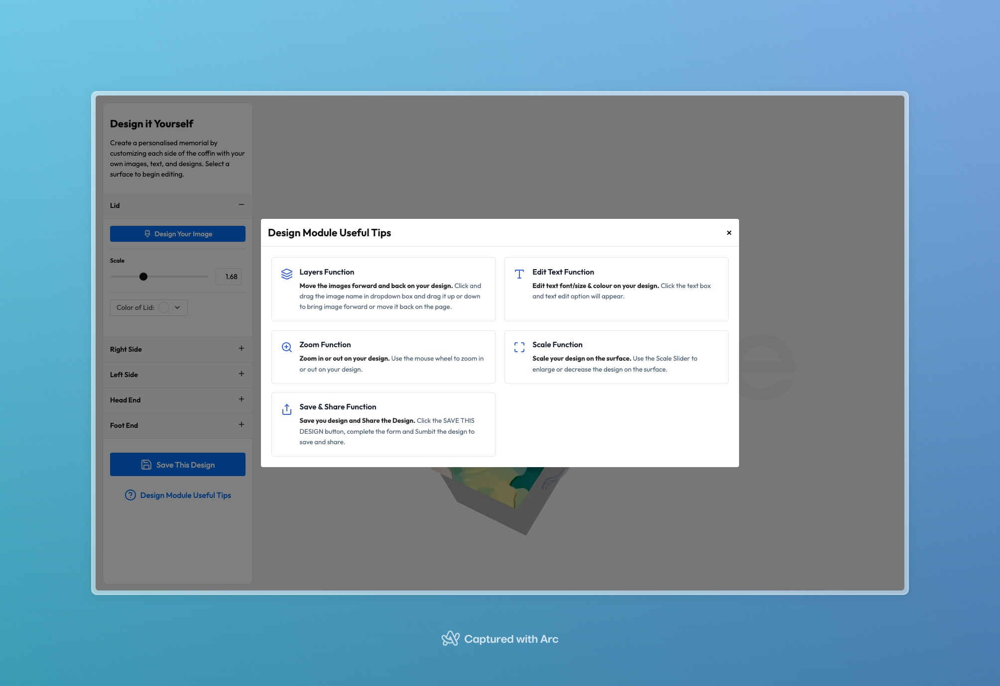
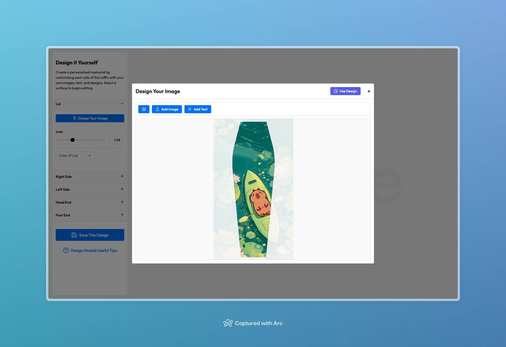
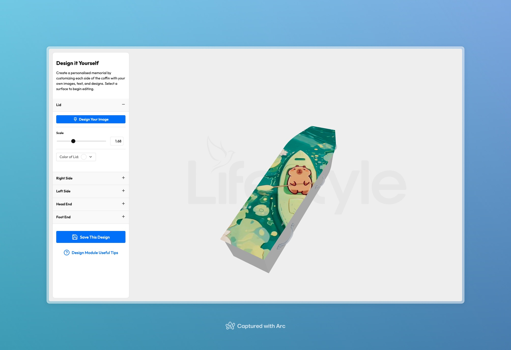

# Applycation Design Coffin

A React-based 3D coffin customization application that allows users to create personalized memorials by customizing each side of a coffin with custom images, text, and designs.

## Preview






## Features

- Interactive 3D coffin model visualization
- Customizable surfaces on each side of the coffin
- Upload and apply custom images
- Add personalized text and designs
- Real-time preview of customizations
- Intuitive surface selection interface

## Technologies Used

- [React](https://reactjs.org/) - Frontend framework
- [Three.js](https://threejs.org/) - 3D graphics library
- [React Three Fiber](https://docs.pmnd.rs/react-three-fiber) - React renderer for Three.js
- [React Three Drei](https://github.com/pmndrs/drei) - Useful helpers for React Three Fiber
- [Zustand](https://github.com/pmndrs/zustand) - State management
- [Immer](https://immerjs.github.io/immer/) - Immutable state management

## Installation

1. Clone the repository:
```bash
git clone https://github.com/yourusername/applycation-design-coffin.git
```

2. Install dependencies:
```bash
cd applycation-design-coffin
npm install
```

3. Start the development server:
```bash
npm run dev
```

## Usage

1. Open the application in your browser
2. Click on any surface of the 3D coffin to select it for editing
3. Use the editing tools to:
   - Upload custom images
   - Add text
   - Apply designs
   - Adjust colors and patterns
4. Preview your changes in real-time
5. Save or export your customized design
